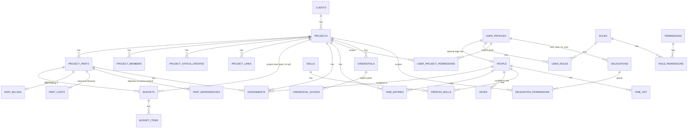

# Phase 2 schema + RLS reference

Phase-gate review document. Covers everything added by the six Phase 1 + 2
migrations (`supabase/migrations/20260714000001_phase1_auth.sql` through
`20260715000006_credentials_delegations.sql`) and the demo seed
(`supabase/seed.sql`). Verified end-to-end against a clean local Supabase
instance: `npm run test` (20/20 vitest), `npm run db:reset` →
`npm run test:db` (95/95 pgTAP) → `npm run seed:admin` → `npm run test:db`
again (95/95, confirming test order-independence), `npm run build` (clean).

30 tables in `public`, 16 functions, 76 RLS policies.

---

## 1. Table inventory

One line per table: purpose · key columns · owning migration.

### Auth / permission

| Table | Purpose | Key columns | Migration |
|---|---|---|---|
| `user_profiles` | One row per `auth.users` account; approval workflow state | `id` (=`auth.users.id`), `email`, `full_name`, `status` (`pending`/`active`/`disabled`), `approved_by`, `approved_at` | 0001 (role column added then dropped in 0002) |
| `roles` | Role catalog | `key` (PK: `admin`, `project_manager`, `finance`, `member`, `viewer`), `name` | 0002 |
| `permissions` | Permission catalog (25 keys) | `key` (PK), `description`, `delegatable` | 0002 |
| `role_permissions` | Role → permission grants with scope | `role_key`, `permission_key`, `scope` (`global`/`own_projects`/`member_projects`) | 0002 |
| `user_roles` | User → role assignment (v1: single row per user in UI, but schema allows many) | `user_id`, `role_key`, `granted_by`, `granted_at` | 0002 |
| `user_project_permissions` | Explicit per-project/per-permission grants (viewer access, temporary overrides) | `user_id`, `project_id`, `permission_key`, `granted_by`, `expires_at` | 0002 (FK to `projects` added in 0003) |

### Projects

| Table | Purpose | Key columns | Migration |
|---|---|---|---|
| `clients` | Client directory | `name`, `contact_name`, `contact_email` | 0003 |
| `projects` | Core project record | `client_id`, `pm_id`, `owner_id`, `status`, `health`, `priority`, `budget_type`, `progress`, `tags` | 0003 |
| `project_members` | Team membership (drives `member_projects` scope) | `project_id`, `user_id`, `role_on_project`, `starts_on`/`ends_on` | 0003 |
| `project_parts` | Work breakdown within a project | `project_id`, `name`, `status`, `responsible_person_id`, `billing_model`, `estimated_hours`, `progress` | 0003 (FK to `people` added in 0004) |
| `part_dependencies` | Part-to-part dependency edges | `part_id`, `depends_on_part_id` (trigger-enforced: same project only) | 0003 |
| `project_status_updates` | Immutable status-report history | `project_id`, `author_id`, `completed`/`in_progress`/`blockers`/`decisions_needed`/`next_milestone`/`handover_info` | 0003 |
| `project_links` | Repos/envs/docs with visibility tiers | `project_id`, `url`, `type`, `visibility` (`project`/`pm_only`/`admins_only`) | 0003 |

### People / workload

| Table | Purpose | Key columns | Migration |
|---|---|---|---|
| `people` | Resourcing directory (optionally linked to a login) | `user_id` (nullable FK to `user_profiles`), `full_name`, `department`, `employment_type`, `weekly_capacity_hours`, `status` | 0004 |
| `skills` | Skill catalog | `name`, `category` | 0004 |
| `person_skills` | Person ↔ skill with proficiency | `person_id`, `skill_id`, `level` (1–5) | 0004 |
| `time_off` | Vacation/sick/other leave | `person_id`, `starts_on`, `ends_on`, `type` | 0004 |
| `assignments` | Person allocated to a project (optionally a part) | `project_id`, `project_part_id`, `person_id`, `allocation_pct`, `start_date`/`end_date` | 0004 |
| `time_entries` | Logged hours | `person_id`, `project_id`, `project_part_id`, `entry_date`, `hours`, `billable` | 0004 |
| `rates` | Per-person cost & billing rates, finance-only | `person_id`, `rate_type` (`internal_cost`/`billing`), `amount`, `valid_from`/`valid_to` | 0004 |

### Budgets

| Table | Purpose | Key columns | Migration |
|---|---|---|---|
| `part_billing` | Client-facing money for a part | `part_id` (PK/FK), `fixed_amount`, `hourly_rate`, `client_price` | 0005 |
| `part_costs` | Internal money for a part (finance only) | `part_id` (PK/FK), `planned_internal_cost`, `actual_internal_cost` | 0005 |
| `budgets` | Budget envelope — project-level (`part_id` null) or part-level | `project_id`, `part_id` (nullable), `currency` — unique index enforces at most one project-level budget | 0005 |
| `budget_items` | Ledger entries against a budget (attribution immutable after insert) | `budget_id`, `item_type` (`planned_cost`/`actual_cost`/`invoice`/`payment`/`change`), `amount`, `occurred_on`, `created_by` | 0005 |

### Credentials / delegations

| Table | Purpose | Key columns | Migration |
|---|---|---|---|
| `credentials` | Credential metadata only — no secret material | `project_id`, `name`, `type`, `secret_id` (→ `vault.secrets`), `environment`, `visibility` (`project_members`/`pms_only`/`admins_only`), `owner_id` | 0006 |
| `credential_access` | Explicit per-user credential grants (beyond visibility tier) | `credential_id`, `user_id`, `granted_by`, `expires_at` | 0006 |
| `delegations` | Time-boxed PM → PM delegation (e.g. vacation cover) | `from_user`, `to_user`, `starts_at`/`ends_at`, `revoked_at`/`revoked_by` (one-way revoke, then immutable) | 0006 |
| `delegation_permissions` | Which permission, on which project, a delegation grants | `delegation_id`, `project_id`, `permission_key` (delegatable-only, project must belong to `from_user`) | 0006 |

### System

| Table | Purpose | Key columns | Migration |
|---|---|---|---|
| `audit_logs` | Append-only security/audit trail | `actor_id`, `action`, `resource_type`/`resource_id`, `metadata` | 0001 |
| `notifications` | In-app notifications (e.g. "new user pending") | `user_id`, `type`, `title`, `read_at` | 0001 |

---

## 2. Permission model

### The 25 permission keys

`view_project`\*, `edit_project`\*, `create_project`, `edit_status`\*, `view_team`\*,
`manage_project_members`, `view_links`\*, `manage_links`\*, `view_budget`,
`manage_budget`, `view_internal_cost`, `view_clients`, `manage_clients`,
`view_people`, `manage_people`, `log_time`, `view_time`, `view_credentials`\*,
`reveal_credential`, `manage_credentials`, `manage_delegations`, `manage_access`,
`manage_users`, `view_audit`, `export_data`.

\* = `delegatable = true` (7 of the 25): `view_project`, `edit_project`,
`edit_status`, `view_team`, `view_links`, `manage_links`, `view_credentials`.
Budgets, costs, credential-reveal, user/access management, and audit are
**never** delegatable — enforced by the `enforce_delegatable_permission`
trigger on `delegation_permissions`, independent of what a UI might allow.

### Role → permission matrix

Blank cell = role has no grant for that permission (falls through to
explicit `user_project_permissions` grants or an active delegation, or is
simply denied). `admin` is not a row — it never needs one, see below.

| Permission | project_manager | finance | member | viewer |
|---|---|---|---|---|
| `view_project` | global | | member_projects | |
| `edit_project` | own_projects | | | |
| `create_project` | global | | | |
| `edit_status` | own_projects | | | |
| `view_team` | global | global | member_projects | |
| `manage_project_members` | own_projects | | | |
| `view_links` | global | global | member_projects | |
| `manage_links` | own_projects | | | |
| `view_budget` | own_projects | global | | |
| `manage_budget` | own_projects | global | | |
| `view_internal_cost` | | global | | |
| `view_clients` | global | global | | |
| `manage_clients` | global | | | |
| `view_people` | global | global | global | |
| `manage_people` | | | | |
| `log_time` | global | | global | |
| `view_time` | own_projects | global | | |
| `view_credentials` | own_projects | | | |
| `reveal_credential` | own_projects | | | |
| `manage_credentials` | own_projects | | | |
| `manage_delegations` | own_projects | | | |
| `manage_access` | | | | |
| `manage_users` | | | | |
| `view_audit` | | | | |
| `export_data` | | | | |

`viewer` deliberately has **zero** role_permissions rows — every bit of
access a viewer has comes from an explicit `user_project_permissions` grant
(see seed: Vera gets `view_project` + `view_links` on one project, 30-day
expiry). `manage_people`, `manage_access`, `manage_users`, `view_audit`,
`export_data` have no role grants at all in v1 — admin-only, via the
`is_admin()` bypass.

### How `has_permission(uid, perm, project)` resolves

Defined identically (`create or replace`) across 0002 → 0003 → 0006, each
version additive. Final (v3) resolution order:

1. **Admin bypass** — `is_admin(uid)` short-circuits everything else.
2. **Active-profile gate** — every branch below requires
   `user_profiles.status = 'active'` for `uid`. A disabled user's still-valid
   JWT cannot pass RLS through role, explicit-grant, or delegation branches.
3. **Global scope** — `user_roles` → `role_permissions` where
   `scope = 'global'` (ignores the `project` argument entirely).
4. **`own_projects` scope** — same join, `scope = 'own_projects'`, requires
   `projects.pm_id = uid` for the given `project`.
5. **`member_projects` scope** — same join, `scope = 'member_projects'`,
   requires a `project_members` row for `(project, uid)`.
6. **Explicit grants** — `user_project_permissions` row for
   `(uid, perm)`, unexpired, matching `project` (or global if `project` is
   null).
7. **Active delegations** — `delegations` ⋈ `delegation_permissions` where
   `to_user = uid`, `revoked_at is null`, `now()` inside `[starts_at, ends_at)`,
   and the permission is granted for that specific `project`.

Every branch after the admin bypass is scoped: global-scope permissions
(`view_clients`, `manage_clients`, `view_people`, `log_time`, etc.) are
checked without a project argument; every other resource policy passes the
row's own `project_id` (or, for part-scoped financial tables, the project
resolved via the `part_project()` helper) as the third argument.

The `user_project_permissions` (explicit per-project grant) branch of
`has_permission` only ever satisfies a **project-scoped** check
(`project is not null and upp.project_id = project`) — a per-project grant can
never satisfy an unscoped/global check. This is what makes the
person-level `rates` table safe even though its policy calls
`view_internal_cost` without a project argument: only finance's **global**
role grant passes that check; an admin handing someone `view_internal_cost`
scoped to a single project does **not** expose the company-wide rate card.
(This closed a Critical found in the Phase-2 final review — see the hardening
list below.)

---

## 3. RLS approach

One representative pattern per cluster (actual SQL from the migrations),
plus the cross-cutting rules.

**Auth/permission** — catalog tables are read-open to any authenticated
user (needed to render role/permission labels in the UI), writes are
migration/service-role only:

```sql
create policy "read permissions" on public.permissions
  for select using (auth.uid() is not null);
-- no insert/update/delete policy exists for this table
```

**Projects** — the `has_permission(uid, perm, project)` pattern used
everywhere in this cluster:

```sql
create policy "view project" on public.projects
  for select using (public.has_permission(auth.uid(),'view_project', id));
create policy "create project" on public.projects
  for insert with check (
    public.has_permission(auth.uid(),'create_project')
    and (pm_id = auth.uid() or public.is_admin()));
```
The `create project` check does double duty: it requires the
`create_project` permission *and* pins `pm_id` to the actor (unless admin) —
closing a gap where a PM could otherwise create a project owned by someone
else and inherit `own_projects` scope on it via a spoofed `pm_id`.

**People/workload** — permission-gated by default, with an "or it's your
own row" escape hatch for self-service data (time entries, own time off):

```sql
create policy "read own time" on public.time_entries
  for select using (person_id = public.current_person_id());
create policy "log own time" on public.time_entries
  for insert with check (
    public.has_permission(auth.uid(),'log_time')
    and person_id = public.current_person_id()
    and exists (
      select 1 from public.assignments a
      where a.person_id = time_entries.person_id
        and a.project_id = time_entries.project_id));
```
Time-entry insert additionally requires an `assignments` row — you can only
log time against a project you're actually assigned to.

**Budgets — the financial table-separation rationale.** Client-facing money
and internal money are split into two tables specifically so they can carry
different RLS, rather than trying to column-mask one table:

```sql
create policy "view part billing" on public.part_billing
  for select using (public.has_permission(auth.uid(),'view_budget', public.part_project(part_id)));
create policy "finance views part costs" on public.part_costs
  for select using (public.has_permission(auth.uid(),'view_internal_cost', public.part_project(part_id)));
```
`part_billing` (`fixed_amount`/`hourly_rate`/`client_price`) is gated by
`view_budget`, held by PMs (own_projects) and finance (global). `part_costs`
(`planned_internal_cost`/`actual_internal_cost`) is gated by
`view_internal_cost`, which **only finance holds, globally** — PMs never see
internal margin. `rates` (per-person cost/billing rate) is finance-only in
both directions (`view_internal_cost` AND `manage_budget` for writes) — a PM
prices hourly work via `part_billing.hourly_rate`, never via a person's
actual rate card.

**Credentials — metadata-only + Vault.** No secret material is stored in
Postgres in a client-readable form:

```sql
create table public.credentials (
  ...
  secret_id uuid not null,   -- references vault.secrets; vault schema has zero
                              -- grants to anon/authenticated, so there is no
                              -- RLS read-path to the raw value at all
  visibility public.credential_visibility not null default 'project_members',
  ...
);
```
`vault.create_secret()` is called only from the seed / service-role code;
`reveal_credential` is a permission that gates the *server action* that
calls a Vault decrypt RPC, not a column in this table.

**Status updates — immutability.** No `UPDATE` policy exists, and the table
grant itself omits `UPDATE`:

```sql
create policy "post status update" on public.project_status_updates
  for insert with check (public.has_permission(auth.uid(),'edit_status', project_id) and author_id = auth.uid());
create policy "admin delete status update" on public.project_status_updates
  for delete using (public.is_admin());
grant select, insert, delete on public.project_status_updates to authenticated;  -- no UPDATE
```
Immutability is therefore enforced twice — no policy *and* no privilege —
so a future accidental `create policy ... for update` wouldn't silently
reopen it (the grant would still block it).

**Cross-cutting rule: every `has_permission` call passes a project arg
unless the permission is a global-only one.** Global permissions
(`view_clients`, `manage_clients`, `view_people`, `log_time`) are checked
bare; every project/part/budget/credential/delegation policy resolves and
passes the owning `project_id` — directly, through a join, or through a
helper (`part_project(part_id)` for part-scoped financial tables). This is
what makes `own_projects`/`member_projects` scoping and per-project explicit
grants/delegations actually project-specific instead of leaking globally.

---

## 4. Entity-relationship diagram



---

## 5. Open questions for the reviewer

1. **PM portfolio visibility is global-view.** `project_manager` holds
   `view_project`/`view_team`/`view_clients`/`view_links` at `global` scope
   — every PM can see every project in the portfolio (read-only outside
   their own), not just their assigned ones. Only *editing* is
   `own_projects`-scoped. Confirm this matches intent vs. restricting PM
   read visibility to their own projects too.
2. **Rates are finance-only, globally.** `rates` (per-person internal
   cost/billing rate) is gated entirely by `view_internal_cost` +
   `manage_budget`, both finance-only. PMs price hourly-billed parts via
   `part_billing.hourly_rate` (a project/part-level client price), never via
   a person's actual rate card. Confirm PMs are not expected to see
   person-level rates anywhere in the UI.
3. **Single role per user in v1.** `user_roles` schema supports multiple
   roles per user (composite PK, no uniqueness on `user_id` alone), but the
   admin UI (Phase 1 approval flow) is expected to assign exactly one. If
   multi-role is ever exposed, `has_permission` already unions across all of
   a user's roles correctly — no schema change needed, only a UI decision.
4. **`granted_by`/`created_by` attribution is admin-trusted, not
   self-enforced.** Columns like `user_roles.granted_by`,
   `user_project_permissions.granted_by`, `credential_access.granted_by`,
   `delegations.revoked_by` are plain nullable FKs with no trigger/RLS
   forcing them to equal `auth.uid()` at write time (unlike
   `budget_items.created_by`, which *is* enforced via `with check`). They're
   trusted because only admins/managers can reach these write paths at all,
   but nothing stops a manager from writing a colleague's id into
   `granted_by`. Acceptable for v1, or worth enforcing consistently later?
5. **Time-entry-requires-assignment.** `log own time` requires an
   `assignments` row for `(person, project)` before a time entry is
   accepted. Confirm this is the desired guardrail (vs. allowing ad-hoc time
   logging on any project a member can see).
6. **Sick-leave privacy.** `view time_off` exposes `vacation`-type rows to
   anyone with `view_people`, but restricts `sick`/`other` rows to the
   person themselves, `manage_people` holders, or admins. Confirm this
   matches the intended privacy bar (i.e., a PM without `manage_people`
   cannot see *why* a team member is out, only that vacation-type leave
   exists).
7. **Deferred hygiene items** (not blocking, flagged for a future pass):
   - `pgTAP` test suite uses `\gset`, which may not run under
     `supabase test db` on some CLI versions — a fallback was written into
     Task 6's tests defensively; worth confirming on CI's exact CLI version.
   - `people.status` (`active`/`inactive`) exists but no RLS/UI currently
     acts on it differently from a person's presence/absence in query
     results — decide whether inactive people should be hidden from
     assignment pickers etc. in Phase 3+.
   - `export_data` permission is cataloged (spec: "v2") but has no
     implementation surface yet — purely a placeholder key.

---

## Security hardening during Phase 2

Six issues were found and fixed during implementation/review, each visible
as an inline `-- NOTE (review finding)` or equivalent comment in the
migrations:

1. **Active-profile gate on `has_permission`.** Original draft resolved
   role/grant/delegation branches without checking `user_profiles.status`.
   A disabled user's still-valid JWT could otherwise keep passing RLS
   through role or explicit-grant branches after being disabled. Fixed by
   wrapping every non-admin branch in an `status = 'active'` existence
   check (0003, carried into 0006).
2. **`part_costs` project-scoping leak.** An early draft of
   `finance views part costs` called `has_permission(auth.uid(),
   'view_internal_cost')` without a project argument. Because
   `view_internal_cost` is finance's only `global`-scope grant, the check
   itself still worked for finance — but a *per-project* explicit grant on
   `view_internal_cost` (via `user_project_permissions`) would have matched
   `part_costs` rows for **every** project, not just the granted one. Fixed
   by threading `part_project(part_id)` through as the third argument.
3. **Cross-project dependency leak.** `part_dependencies` initially had no
   guard preventing a dependency edge between parts in two different
   projects. Fixed with the `enforce_same_project_dependency` trigger,
   which raises if `part_id` and `depends_on_part_id` don't share a
   `project_id`.
4. **`pm_id` binding on project creation.** The `create project` policy's
   original `with check` only tested `has_permission(...,'create_project')`,
   which let any project_manager insert a row with an arbitrary `pm_id`,
   instantly acquiring `own_projects`-scope permissions (edit, budget,
   credentials, delegation) over a project "owned" by someone else. Fixed
   by additionally requiring `pm_id = auth.uid() or is_admin()`.
5. **`admins_only` credential visibility bypass on writes.** The read
   policy on `credentials` correctly hid `admins_only` rows from non-admins,
   but the original insert/update/delete policies checked only
   `manage_credentials` — a project-scoped PM with that permission could
   `UPDATE`/`DELETE` (or even flip the visibility of) an `admins_only`
   credential they couldn't `SELECT`. Fixed by adding the same
   `(visibility <> 'admins_only' or is_admin())` gate to all three write
   policies.
6. **`has_credential_access` recursion lockdown.** Embedding the
   `credential_access` lookup directly in the `credentials` SELECT policy
   as a correlated subquery created an RLS cycle (`credentials` policy reads
   `credential_access`, whose own policies read `credentials` back →
   "infinite recursion detected in policy for relation"). Fixed by
   extracting the lookup into a `security definer` function
   (`has_credential_access`) that bypasses RLS the same way `has_permission`
   /`is_admin` already do, scoped tightly to the one
   `(credential_id, user_id)` pair plus expiry — no broader access implied.
